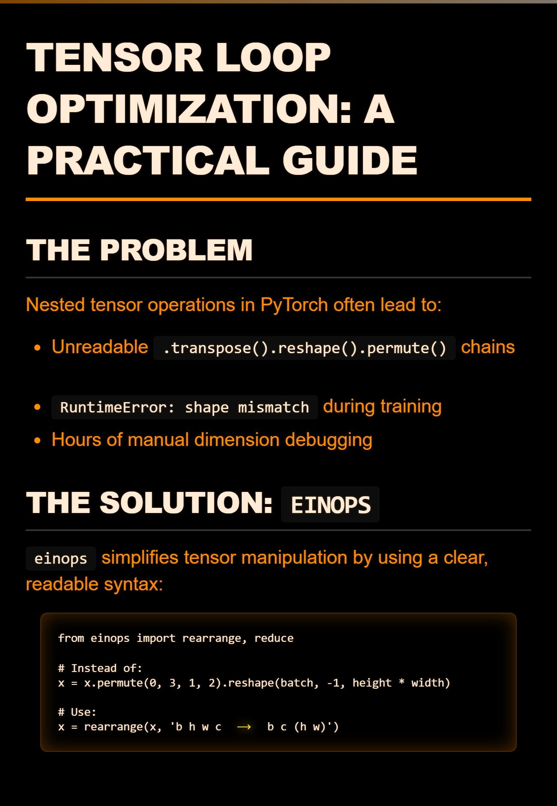
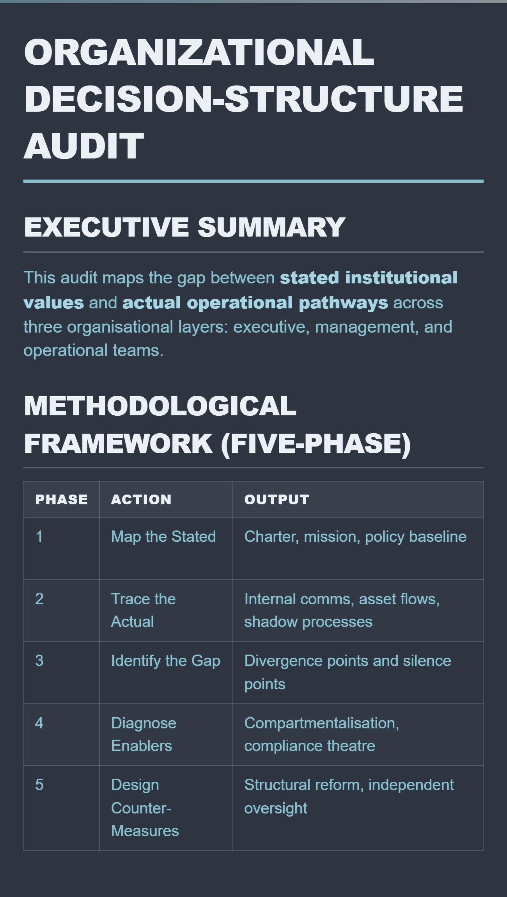
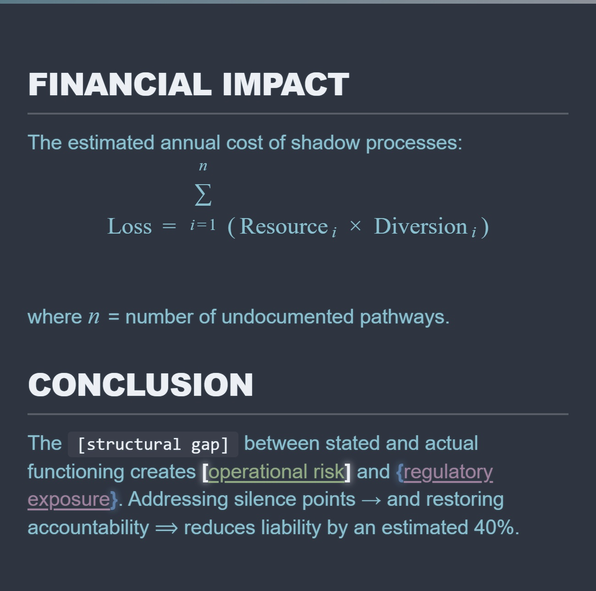
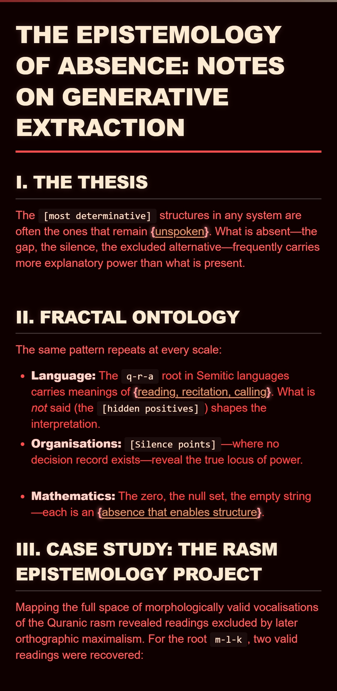
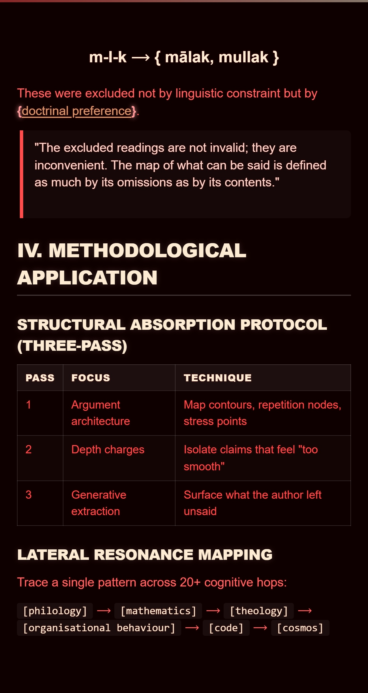
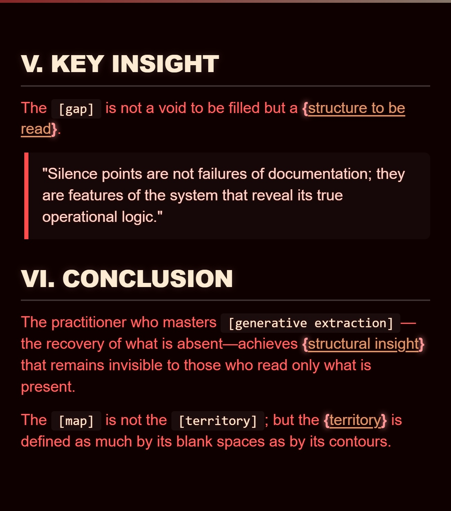

# Folio – Markdown Image Renderer

*Turn markdown into styled, publication‑ready image cards. Auto‑splits long content. Client‑side. No servers.*

---

## Quick Preview

<p align="center">
  
</p>

---

## The Name

**Folio** is a leaf of a manuscript or book—a discrete, numbered page that holds written text. In scribal tradition, a folio is the fundamental unit of the physical archive: a bounded surface that preserves structure, enforces legibility, and demands careful composition.

This tool transforms your continuous markdown stream into a bound set of folios (image cards). It restores the discipline of the page to the fluidity of digital text—each card is a clean, styled surface ready for presentation, archive, or distribution.

---

## What It Does

**Folio** renders markdown as high‑quality JPEG images. Paste your text, choose a theme and styling mode, and export. If your content exceeds the defined height limit, it is automatically split across multiple pages (folios)—preserving headers, lists, tables, and structural context—so nothing is cropped or lost.

Everything runs in your browser. No uploads, no API keys, no server dependencies.

---

## Why You Would Use This

| Problem | Solution |
| :--- | :--- |
| Design tools (Canva, Photoshop) are slow and inconsistent. | One click from markdown to styled pages. |
| Long text gets cropped or truncated by image generators. | Auto‑splitting preserves all content across multiple cards. |
| Team members use different editors and formatting. | Single markdown source produces consistent, branded output. |
| Screenshots look unprofessional and lack typographic control. | Themed, colour‑coded renders with bracket semantics and math support. |
| Sharing raw LLM outputs (tables, code, nested lists) is messy. | Render AI‑generated markdown directly as structured visual assets. |

---

## Key Features

| Feature | Description |
| :--- | :--- |
| **Full markdown support** | Headers, lists, tables, blockquotes, code blocks, LaTeX math. |
| **7 colour themes** | Orange, Matrix, Cyber, Nord, Dracula, Solar, Crimson. |
| **5 semantic styling modes** | Standard, Alchemist (polarity), Codex (manuscript), Desert (warm/minimal), Legal (case‑file). |
| **Auto‑splitting** | Breaks content across multiple pages; preserves headers and list context. |
| **Bracket highlighting** | Distinguishes `[square]`, `{curly}`, `«guillemets»`, `‹chevrons›`. |
| **Linguistic root detection** | Auto‑highlights 3‑letter patterns (e.g., `q-r-a`) as semantic units. |
| **Math rendering** | Inline (`$...$`) and block (`$$...$$`) LaTeX via KaTeX. |
| **Adjustable dimensions** | Card width (400–1200px), max height (400–3000px). |
| **Resolution multiplier** | 1.0× to 3.4× for high‑DPI exports. |
| **Batch download** | One click to download all generated pages in sequence. |
| **Keyboard shortcut** | `Ctrl+Enter` / `Cmd+Enter` to render. |

---

## Markdown Support

| Element | Supported | Notes |
| :--- | :--- | :--- |
| Headers (`#` – `####`) | ✅ | Distinct styling for H1–H4. |
| Bullet lists (`-`, `*`) | ✅ | Nested lists supported. |
| Numbered lists (`1.`) | ✅ | Sequential numbering preserved across splits. |
| GFM Tables (`\|...\|`) | ✅ | Bordered cells, header background. |
| Code blocks (`` ``` ``) | ✅ | Monospace, background, line‑preserving. |
| Blockquotes (`>`) | ✅ | Left border, italic body, nested support. |
| Inline math (`$...$`) | ✅ | KaTeX rendering. |
| Display math (`$$...$$`) | ✅ | Block‑level equations. |
| `->` and `=>` | ✅ | Rendered as drift (`⟶`) and logic (`⟹`) vectors. |
| 3‑letter roots (e.g., `q-r-a`) | ✅ | Auto‑detected and wrapped as irreducible units. |

---

## How to Use

1. Open `index.html` in any modern browser (Chrome, Firefox, Edge, Safari).  
   *GitHub does not host HTML files as live pages—you must download and open the file locally.*
2. Paste your markdown text into the text area.
3. Select a **theme** and **semantic mode**.
4. Adjust card **width**, **max height**, and **resolution** using the sliders.
5. Click **Render Images** (or press `Ctrl+Enter` / `Cmd+Enter`).
6. Preview each card and download them individually, or click **Download All Images**.

---

## Configuration Options

| Control | Range / Options | Effect |
| :--- | :--- | :--- |
| **Card Width** | 400–1200 px | Horizontal canvas size; affects font scaling and layout density. |
| **Max Height** | 400–3000 px | Vertical threshold that triggers page splits. |
| **Resolution Multiplier** | 1.0× – 3.4× | Scales final image for high‑DPI export (e.g., 2.0× for retina). |
| **Full Artifacts / Cap Length** | Toggle | *Off* = aggressive splitting (word‑by‑word for long paragraphs). *On* = preserves larger blocks with less fragmentation. |

---

## Tech Stack

- **Marked** – Markdown parsing (GFM)
- **KaTeX** – Math rendering
- **html-to-image** – DOM‑to‑image conversion
- **Vanilla JavaScript** – no build tools, no frameworks

All dependencies are loaded from CDN. The entire application is a single HTML file.

---

## Quick Start

```bash
git clone https://github.com/MrSavage009/Folio.git
cd Folio
# Open index.html in your browser
```

Or simply download `index.html` and open it directly.

---

## File Structure

```
.
├── index.html          # Complete application (self‑contained)
├── README.md           # This file
├── or1.jpg             # Example output – Orange theme
├── nord1.jpg           # Example output – Nord theme (part 1)
├── nord2.jpg           # Example output – Nord theme (part 2)
├── nord3.jpg           # Example output – Nord theme (part 3)
├── crimson1.jpg        # Example output – Crimson theme (part 1)
├── crimson2.jpg        # Example output – Crimson theme (part 2)
└── crimson3.jpg        # Example output – Crimson theme (part 3)
```

---

## License

MIT – use it, modify it, distribute it. No restrictions.

---

## Author

**Wadoed Baykir** – Cognitive Systems Architect, AI Engineer.  
[GitHub](https://github.com/MrSavage009) · [LinkedIn](https://linkedin.com/in/wadoed-baykir)

---

## Example Outputs

Below are three complete examples showing markdown input and the resulting rendered images.

---

### Example 1: Technical / Developer (1 Image – Orange Theme)

**Input markdown:**

````markdown
# Tensor Loop Optimization: A Practical Guide

## The Problem

Nested tensor operations in PyTorch often lead to:
- Unreadable `.transpose().reshape().permute()` chains
- `RuntimeError: shape mismatch` during training
- Hours of manual dimension debugging

## The Solution: `einops`

`einops` simplifies tensor manipulation by using a clear, readable syntax:

```python
from einops import rearrange, reduce

# Instead of:
x = x.permute(0, 3, 1, 2).reshape(batch, -1, height * width)

# Use:
x = rearrange(x, 'b h w c -> b c (h w)')
```

## Performance Comparison

| Method | Lines of Code | Error Rate | Readability |
| :--- | :--- | :--- | :--- |
| Manual `.view()` chains | 8 | 34% | Poor |
| `.einops` | 2 | 5% | Excellent |
| Visual loop compiler | 1 | 2% | Outstanding |

## Mathematical Foundation

The transformation follows a linear mapping:

$$ T: \mathbb{R}^{B \times H \times W \times C} \rightarrow \mathbb{R}^{B \times C \times (H \cdot W)} $$

where $B$ = batch size, $H$ = height, $W$ = width, and $C$ = channels.

## Key Insight

> "The verified guarantee comes from the graphical proof calculus for tensor programming. Slide the spectacles past any SIMD box, normalize both the loop and the proposed `einops` to canonical form, and check if the index maps match."

## Example with Bracket Semantics

The `[batch dimension]` is preserved while `{channel-first ordering}` enforces the new layout. This [isomorphic mapping] ensures mathematical equivalence.

**Root detection:** The concept of `t-n-s` (tensor) and `s-h-p` (shape) remains irreducible.

## Implementation

```bash
git clone https://github.com/example/tensor-optimizer
pip install -r requirements.txt
python run.py --input data/ --output results/
```

## Conclusion

`einops` reduces boilerplate, eliminates shape errors, and makes tensor code self-documenting. Adopt it in your next project → and watch your code clarity ⟹ improve dramatically.
````

**Rendered output:**

<p align="center">
  
</p>

---

### Example 2: Business / Strategy (3 Images – Nord Theme)

*Recommended mode: **Legal / Archival** or **Standard***

**Input markdown:**

````markdown
# Organizational Decision-Structure Audit

## Executive Summary

This audit maps the gap between **stated institutional values** and **actual operational pathways** across three organisational layers: executive, management, and operational teams.

## Methodological Framework (Five-Phase)

| Phase | Action | Output |
| :--- | :--- | :--- |
| 1 | Map the Stated | Charter, mission, policy baseline |
| 2 | Trace the Actual | Internal comms, asset flows, shadow processes |
| 3 | Identify the Gap | Divergence points and silence points |
| 4 | Diagnose Enablers | Compartmentalisation, compliance theatre |
| 5 | Design Counter-Measures | Structural reform, independent oversight |

## Key Findings

### Gap Enablers Identified

- **Silence Points:** Undocumented decision pathways where critical choices bypass formal protocols
- **Linguistic Obfuscation:** Passive voice and `[concern framing]` used to mask operational deviation
- **Compliance Theatre:** Paper-thin regulatory compliance masking active deviation
- **Compartmentalisation:** Structural isolation preventing oversight visibility

### Case Example: Dual-Use Research

A research institution publicly claimed to develop sustainable agricultural solutions. In practice, it conducted {dual-use pathogen research} with potential offensive applications.

> "The gap between stated purpose and actual function was maintained through compartmentalisation, linguistic obfuscation, and compliance theatre."

## Recommendations

1. Establish independent technical review panels
2. Create protected, objective whistleblower pathways
3. Implement real-time decision logging at every node
4. Conduct quarterly structural integrity audits

## Financial Impact

The estimated annual cost of shadow processes:

$$ \text{Loss} = \sum_{i=1}^{n} \left( \text{Resource}_i \times \text{Diversion}_i \right) $$

where $n$ = number of undocumented pathways.

## Conclusion

The `[structural gap]` between stated and actual functioning creates [operational risk] and {regulatory exposure}. Addressing silence points → and restoring accountability ⟹ reduces liability by an estimated 40%.
````

**Rendered output:**

<p align="center">
  
  
  
</p>

---

### Example 3: Philosophical / Analytical (3 Images – Crimson Theme)

*Recommended mode: **Codex Noctis** or **Desert Fathers***

**Input markdown:**

````markdown
# The Epistemology of Absence: Notes on Generative Extraction

## I. The Thesis

The `[most determinative]` structures in any system are often the ones that remain {unspoken}. What is absent—the gap, the silence, the excluded alternative—frequently carries more explanatory power than what is present.

## II. Fractal Ontology

The same pattern repeats at every scale:

- **Language:** The `q-r-a` root in Semitic languages carries meanings of {reading, recitation, calling}. What is *not* said (the `[hidden positives]`) shapes the interpretation.
- **Organisations:** `[Silence points]`—where no decision record exists—reveal the true locus of power.
- **Mathematics:** The zero, the null set, the empty string—each is an {absence that enables structure}.

## III. Case Study: The Rasm Epistemology Project

Mapping the full space of morphologically valid vocalisations of the Quranic rasm revealed readings excluded by later orthographic maximalism. For the root `m-l-k`, two valid readings were recovered:

$$ \text{m-l-k} \rightarrow \{ \text{mālak}, \text{mullak} \} $$

These were excluded not by linguistic constraint but by {doctrinal preference}.

> "The excluded readings are not invalid; they are inconvenient. The map of what can be said is defined as much by its omissions as by its contents."

## IV. Methodological Application

### Structural Absorption Protocol (Three-Pass)

| Pass | Focus | Technique |
| :--- | :--- | :--- |
| 1 | Argument architecture | Map contours, repetition nodes, stress points |
| 2 | Depth charges | Isolate claims that feel "too smooth" |
| 3 | Generative extraction | Surface what the author left unsaid |

### Lateral Resonance Mapping

Trace a single pattern across 20+ cognitive hops:

`[philology]` ⟶ `[mathematics]` ⟶ `[theology]` ⟶ `[organisational behaviour]` ⟶ `[code]` ⟶ `[cosmos]`

## V. Key Insight

The `[gap]` is not a void to be filled but a {structure to be read}.

> "Silence points are not failures of documentation; they are features of the system that reveal its true operational logic."

## VI. Conclusion

The practitioner who masters `[generative extraction]`—the recovery of what is absent—achieves {structural insight} that remains invisible to those who read only what is present.

The `[map]` is not the `[territory]`; but the {territory} is defined as much by its blank spaces as by its contours.
````

**Rendered output:**

<p align="center">
  
  
  
</p>

---

**Questions, issues, or feature requests?** Open a GitHub issue or reach out directly.
